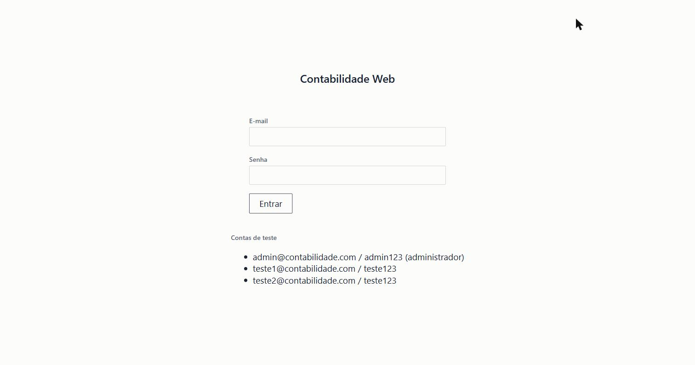
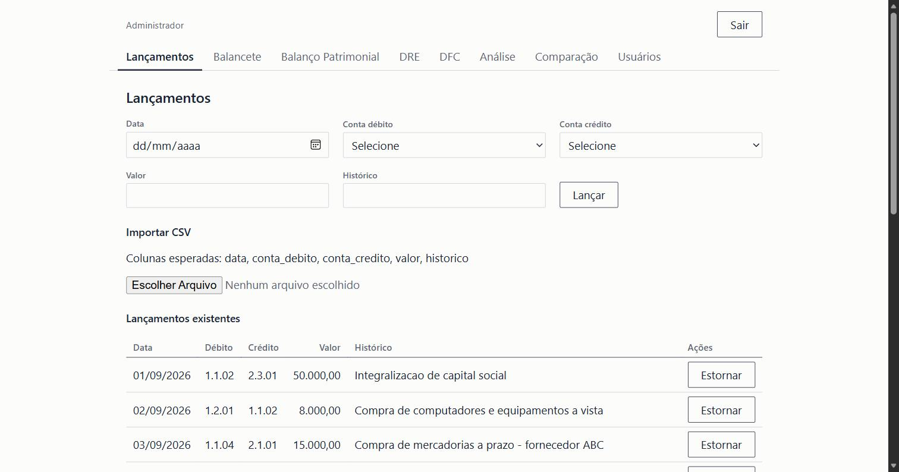
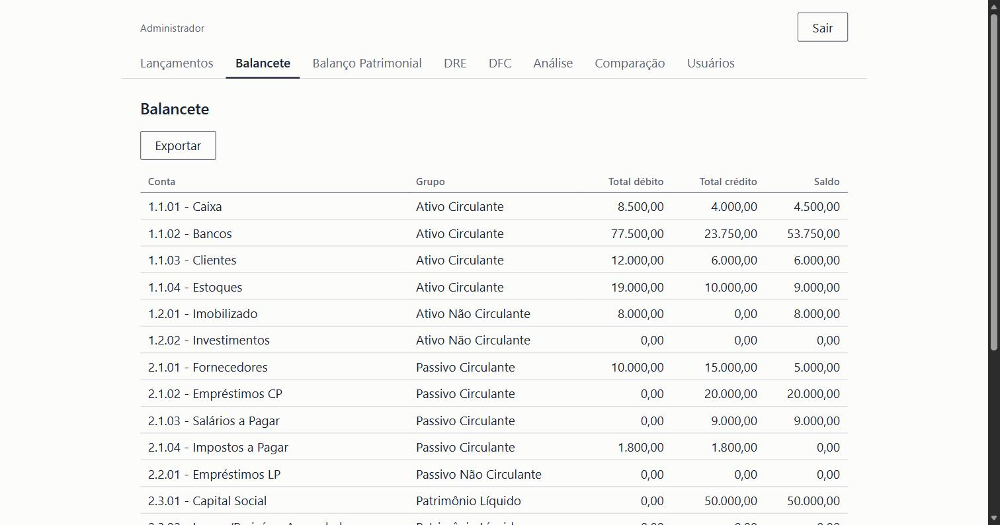
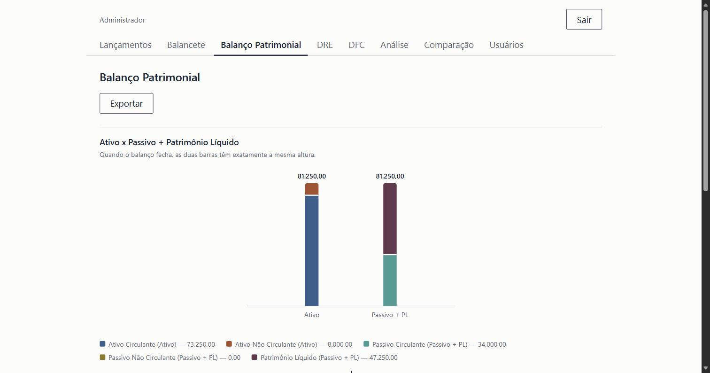
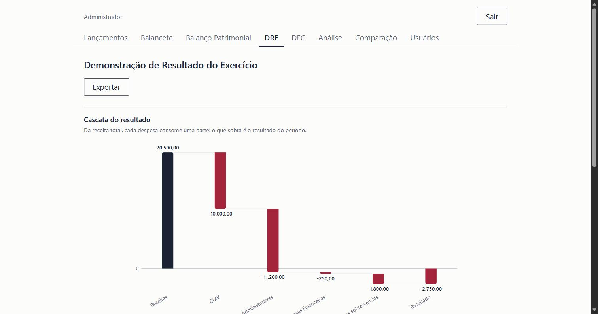
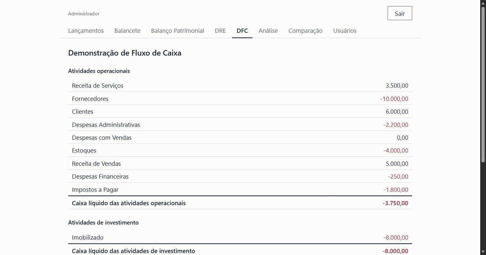
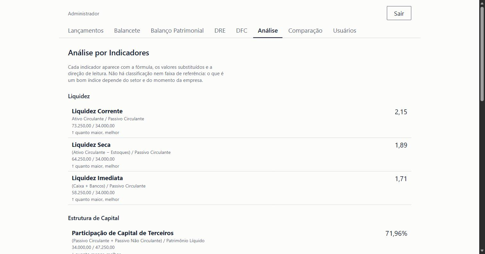
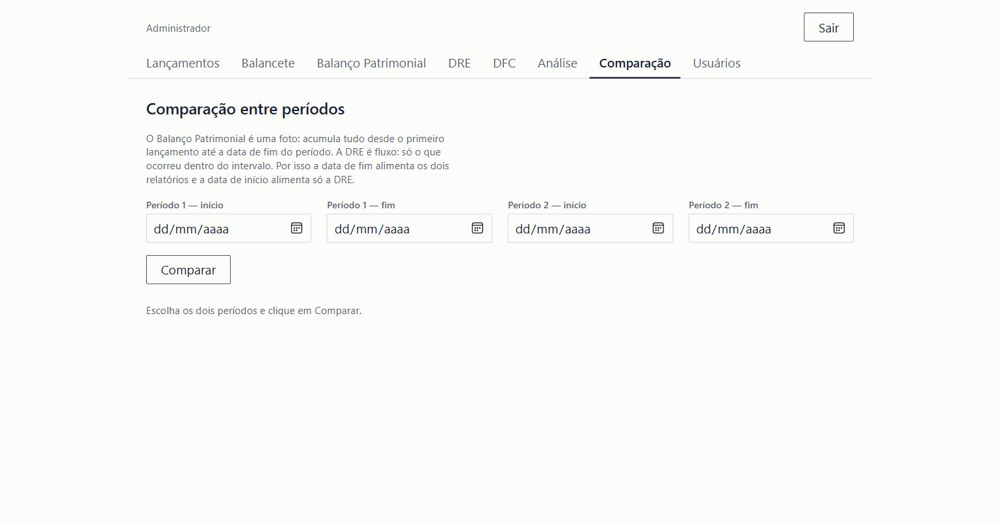
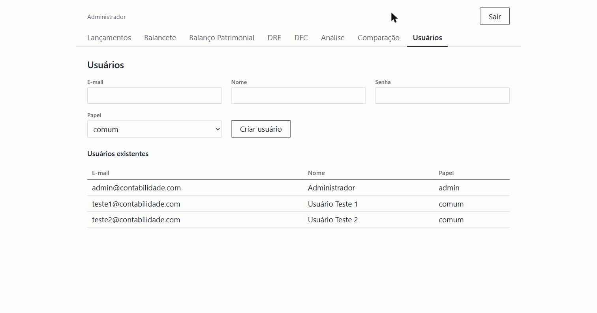

# Contabilidade Web

Aplicação de portfólio que replica o ciclo contábil básico (lançamento →
balancete → Balanço Patrimonial e DRE → Análise por indicadores) com
FastAPI + pandas no backend e React no frontend.

## Telas

| Login | Lançamentos | Balancete |
|---|---|---|
|  |  |  |

| Balanço Patrimonial | DRE | DFC |
|---|---|---|
|  |  |  |

| Análise por indicadores | Comparação entre períodos | Usuários (admin) |
|---|---|---|
|  |  |  |

## Rodando o backend

    cd backend
    python -m venv .venv
    .venv/Scripts/activate   # Windows; no POSIX: source .venv/bin/activate
    pip install -r requirements.txt
    uvicorn app.main:app --reload

A API sobe em http://localhost:8000. Os testes: `pytest -v`.

**Importante para deploy real:** a chave usada para assinar os tokens de
login (`JWT_SECRET`, em `app/auth.py`) tem um valor padrão fixo, adequado
só para rodar localmente. Qualquer deploy fora da máquina de
desenvolvimento deve sobrescrevê-la com uma variável de ambiente própria.

## Rodando o frontend

    cd frontend
    npm install
    npm run dev

O app sobe em http://localhost:5173.

## Login

O app exige login. Três contas são semeadas automaticamente:

| E-mail                    | Senha    | Papel  |
|---------------------------|----------|--------|
| admin@contabilidade.com   | admin123 | admin  |
| teste1@contabilidade.com  | teste123 | comum  |
| teste2@contabilidade.com  | teste123 | comum  |

Essas mesmas credenciais aparecem na própria tela de login. Só a conta
admin vê a aba **Usuários** (criar novas contas e trocar papéis).

## Checklist de verificação manual (end-to-end)

- [ ] Backend e frontend rodando simultaneamente
- [ ] Fazer login com uma conta de teste (comum) e confirmar que a aba
      Usuários não aparece; sair e entrar como admin e confirmar que
      aparece
- [ ] Aba Lançamentos: dropdowns de conta populados
- [ ] Criar um lançamento manual (ex: débito Caixa, crédito Capital
      Social) e ver aparecer na tabela
- [ ] Upload de CSV com uma linha válida e uma com conta inexistente:
      confirmar que a válida entrou e o erro aponta a linha certa
- [ ] Aba Balancete: saldo da conta lançada bate com o valor informado
- [ ] Aba Balanço Patrimonial: Ativo fecha com Passivo + PL (sem aviso
      de desbalanceamento)
  - **Nota:** Este projeto implementa um período único contínuo, sem
    fechamento de exercício. O resultado do período é somado ao
    Patrimônio Líquido automaticamente (mesmo critério em `montar_bp` e
    em `montar_analise`), então o check "Ativo bate com Passivo + PL"
    deve fechar sem aviso de desbalanceamento.
- [ ] Aba DRE: lançar uma receita e uma despesa, conferir que o
      resultado do período é receita - despesa
- [ ] Aba Análise: os 11 indicadores financeiros aparecem agrupados em
      Liquidez, Estrutura de Capital e Rentabilidade, cada um com
      fórmula, valores substituídos, direção de leitura e, quando
      houver, a ressalva metodológica (`observacao`)

## Fixtures de lançamentos

- `lancamentos_exemplo.csv` — 18 lançamentos "felizes": despesas todas
  ≥ 0 e PL positivo. Bom para o fluxo geral, mas não exercita os avisos
  de dados negativos dos gráficos de BP e DRE.
- `lancamentos_casos_extremos.csv` — 4 lançamentos desenhados para
  produzir uma despesa negativa (estorno de CMV maior que o CMV do
  período) e um Patrimônio Líquido negativo, cobrindo os caminhos de
  aviso do conector da cascata da DRE e da seção negativa do BP.
  **Importe este arquivo em um banco recém-semeado** (sem outros
  lançamentos) — os valores só produzem os resultados esperados
  (receitas 2.000; despesas 8.000 + (−500) = 7.500; resultado −5.500;
  PL = 1.000 + (−5.500) = −4.500) partindo de um plano de contas zerado.
